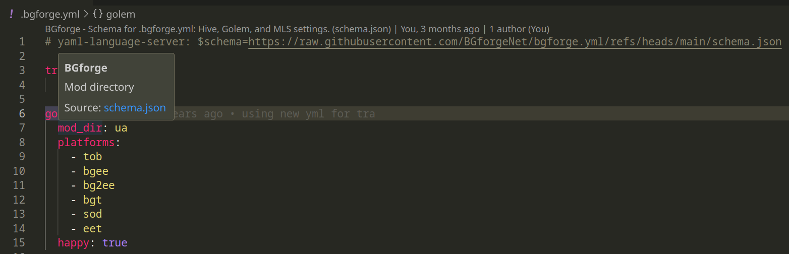

## bgforge.yml schema

This allows you to have intellisense for `.bgforge.yml` used by [Hive](https://hive.bgforge.net/),
[MLS](https://github.com/BGforgeNet/VScode-BGforge-MLS), [Golem](https://golem.bgforge.net).

To use it, install [VScode yaml extension](https://marketplace.visualstudio.com/items?itemName=redhat.vscode-yaml), and
set the first line of your `.bgforge.yml` to

```yaml
# yaml-language-server: $schema=https://raw.githubusercontent.com/BGforgeNet/bgforge.yml/refs/heads/main/schema.json
```

Yes, it's just a comment at the top of the file.
[Example](https://github.com/BGforgeNet/bg2-uniqueartifacts/blob/master/.bgforge.yml).


